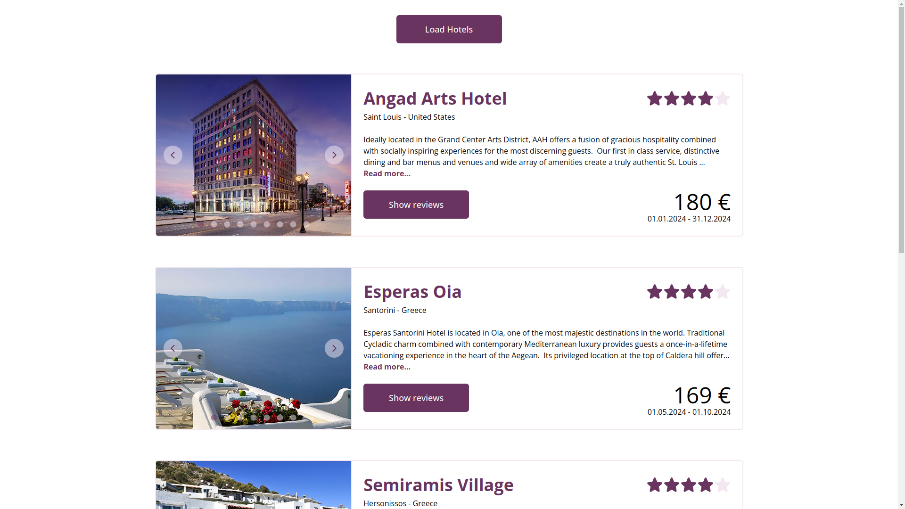
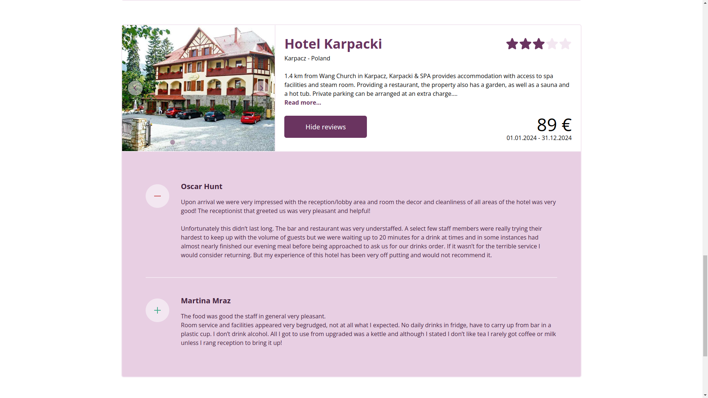
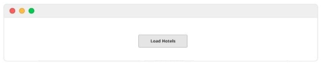
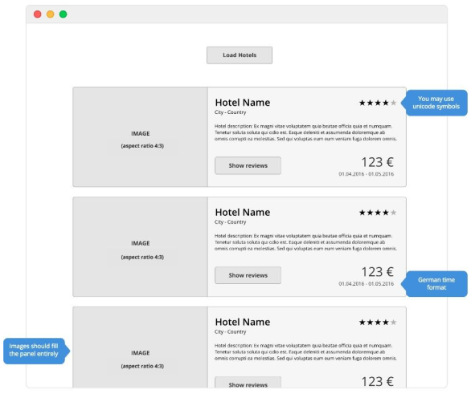
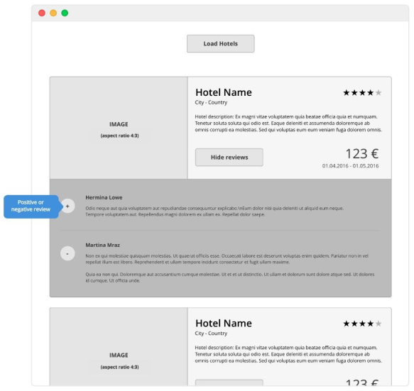

# Hotel List

This is a simple hotel list application that fetches hotel data from an API and displays it in a list. The user can also view reviews for each hotel.

## Preview

## How to Run

1. First install all dependencies: `npm i`
2. Start the server: `npm run dev`
3. Visit `http://localhost:5173/` in your browser.

## Technologies Used

- [React.js](https://reactjs.org/)
- [TailwindCSS](https://tailwindcss.com/)
- [Vite](https://vitejs.dev/)
- [TypeScript](https://www.typescriptlang.org/)
- [rich-text-plain-text-renderer](https://www.npmjs.com/package/@contentful/rich-text-plain-text-renderer)
- [@phosphor-icons/react](https://phosphoricons.com/)
- [GraphQL](https://graphql.org/)
- [URQL](https://formidable.com/open-source/urql/)

## Assignment Description

This test requires knowledge in HTML, CSS and JavaScript.

You are free to choose small libraries (e.g. lodash, Axios) or even frameworks.
Preprocessors and tests of any kind are absolutely optional.

Attached mockups could be seen as a guideline to how the result should look.

If there are open questions, choose the most reasonable answers for yourself.

Should there be problems with the API endpoint, contact us with a detailed bug
description.

### The task

Implement a result list for hotels.

- When the user clicks the „Load hotels“ button, the data of five hotels should be
  received from the API endpoint and rendered on the result page.
- When the user clicks on a „Show reviews“ button, the reviews should be loaded
  for this specific hotel and displayed in a list below the hotel information, but inside
  the hotel item container

### Additional requirements

Use the [rich-text-plain-text-renderer](https://www.npmjs.com/package/@contentful/rich-text-plain-text-renderer) for parsing any RichText (e.g. hotel description).

Should run without errors on current versions of Chrome, Firefox, Safari and Edge.
HTML should be valid for current HTML5 standards. Responsive behaviour is not
requested, but feel free to be creative!

### Mockups

